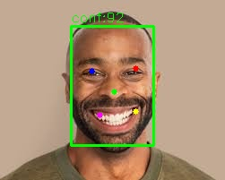

<div align="center">

# Face Detection Using ANN

AI-powered face detection system built using Python, OpenCV, and libfacedetection.



</div>

---

## Features

- Face Detection
- Facial Landmark Detection
- OpenCV Integration
- Fast Processing
- Image-based Detection

---

## Tech Stack

- Python
- OpenCV
- NumPy
- C++
- libfacedetection

---

## Run Project

```bash
python run_detection.py
```

---

## Project Structure

```text
FaceDetectionUsingANN/
│
├── libfacedetection-master/
├── run_detection.py
├── face_detection_result.jpg
└── README.md
```

---

## Author

Bhavik Kaul
